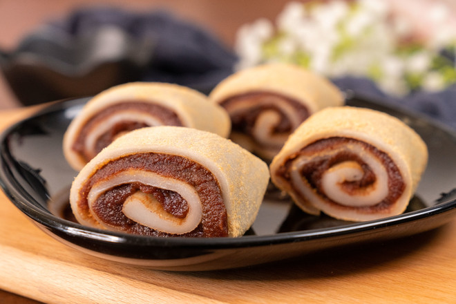
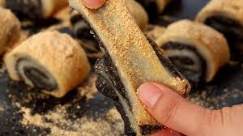
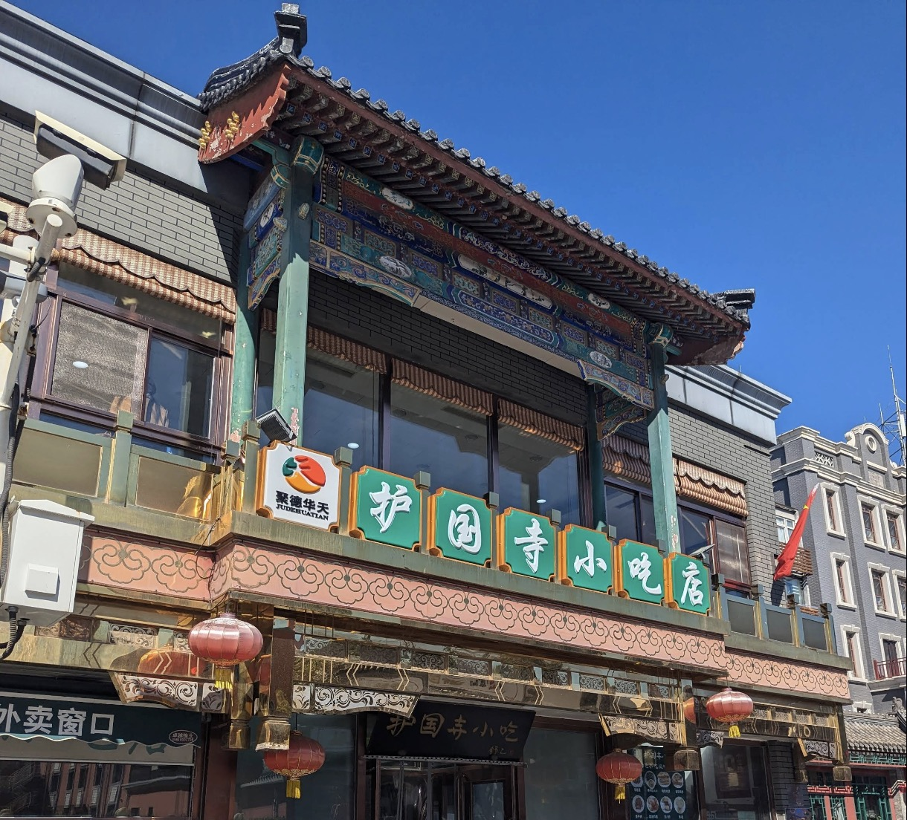

.. SPDX-License-Identifier: GPL-3.0-or-later

=====
驢打滾
=====

文化
====

驢打滾（リュー・ダグン）は、北京の伝統的な菓子。見た目は派手さのない、地味な餅菓子だが、北京
では昔から親しまれてきた。名前は「ロバが地面で転がる」という意味を持つ。「驢」はロバ、「打滾」
は転げ回ることを指す。ただ、実際にロバと関係があるわけではない。

生地を巻いたあと、きな粉の上で転がすように仕上げる工程が、この「打滾」という言葉に重なってい
る。黄粉まみれになった見た目も相まって、そう呼ばれるようになったらしい。

特徴
====

もち米を蒸して、ある程度まで搗く。そこまでなめらかにするわけじゃなく、少し粒が残るくらいでも
いい。生地を広げて、小豆あんをのせて巻く。最後に表面にきな粉をまぶして終わり。昔ながらのやり
方で、特別な材料も工程もない。

手で持つときな粉がぽろぽろ落ちる。中はもっちりしてて、外は粉っぽいけど香ばしい。甘さはあるけ
ど、しつこくない。見た目は地味だけど、食べると案外ちゃんとしてる。

雑談
====

日本に来る前は、よく王府井にある護国寺小吃店に行ってた。
